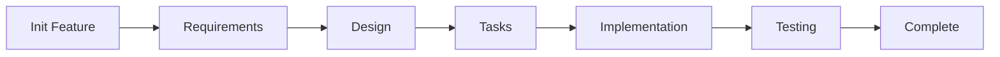

# Compass - Multi-Platform Navigation App

リアルタイムルートガイダンスとクロスデバイス同期を備えた、Android、iOS、Apple Watch向けマルチプラットフォームナビゲーションアプリ

**Status**: 🚧 プロジェクト初期化完了 - 開発準備完了

Flutter + SwiftUI混成ナビゲーションアプリケーション

## プラットフォーム

- **Android**: Flutter
- **iOS**: Flutter  
- **watchOS**: SwiftUI

## Quick Start

### 1. プロジェクト初期化 ✅

```bash
/kiro/init project --hybrid "Compass - A multi-platform navigation app for Android, iOS, and Apple Watch with real-time route guidance and cross-device synchronization"
```

✅ **完了** - 以下が自動生成されました:
- `.kiro/steering/` - プロジェクト全体のガイドライン
  - `product.md` - プロダクトビジョンと目標
  - `tech.md` - 技術スタックとアーキテクチャ
  - `structure.md` - プロジェクト構造
  - `security.md` - セキュリティガイドライン
  - `flutter-best-practices.md` - Flutter開発ベストプラクティス
  - `swift-best-practices.md` - SwiftUI/watchOS開発ベストプラクティス
  - `data-sync.md` - データ同期戦略
- `shared_models/` - クロスプラットフォームデータモデル定義
- プロジェクトディレクトリ構造

### 2. 最初の機能を作成

```bash
/kiro/init feature "User can view real-time navigation route on iPhone and Apple Watch"
```

### 3. 仕様作成（対話的）

```bash
/kiro/spec [feature-name]
```

対話的に以下が実行されます:
1. 要件定義生成 → レビュー
2. 技術設計生成 → レビュー
3. 実装タスク生成 → レビュー
4. 実装開始

### 4. 進捗確認

```bash
/kiro/status
```

---

## Essential Commands

### 🚀 初期化
```bash
/kiro/init project --hybrid "<description>"  # プロジェクト初期化
/kiro/init feature "<description>"           # 機能仕様初期化
```

### 📝 開発
```bash
/kiro/spec [feature-name]              # 対話的モード（推奨）
/kiro/spec [feature-name] requirements # 要件生成
/kiro/spec [feature-name] design -y    # 設計生成（自動承認）
/kiro/spec [feature-name] tasks -y     # タスク生成（自動承認）
/kiro/spec [feature-name] impl         # 実装
```

### 🧪 テスト
```bash
/kiro/test [feature-name] strategy     # テスト戦略生成
/kiro/test [feature-name] unit --tdd   # TDDモード
/kiro/test [feature-name] coverage     # カバレッジレポート
```

### 📊 進捗確認
```bash
/kiro/status                           # 全体ステータス
/kiro/status [feature-name]            # 機能詳細
/kiro/status --dependencies            # 依存関係
/kiro/status --blockers                # ブロッカー
```

---

## Project Structure

```
compass/
├── flutter_app/              # Flutter アプリ (Android/iOS)
│   ├── lib/
│   │   ├── features/         # 機能別モジュール
│   │   ├── core/             # コア機能
│   │   └── shared/           # 共有ユーティリティ
│   └── test/
│
├── watch_app/                # watchOS アプリ (SwiftUI)
│   ├── WatchApp/
│   │   ├── Views/            # SwiftUI ビュー
│   │   ├── ViewModels/       # ビューモデル
│   │   └── Services/         # サービス層
│   └── WatchAppTests/
│
├── shared_models/            # 共有データモデル
│
└── .kiro/                    # 仕様駆動開発
    ├── steering/             # プロジェクトガイドライン
    └── specs/                # 機能仕様
```

---

## Development Workflow



### Workflow詳細

1. **Requirements (要件定義)**
   - EARS形式で要件を記述
   - プラットフォームターゲットを明示
   - 同期要件を定義

2. **Design (技術設計)**
   - アーキテクチャ設計
   - プラットフォーム別コンポーネント定義
   - データ同期戦略

3. **Tasks (タスク分解)**
   - 実装可能な単位に分解
   - プラットフォーム別にタスク分離
   - 要件とのトレーサビリティ確保

4. **Implementation (実装)**
   - TDD (Test-Driven Development)
   - プラットフォーム固有のベストプラクティス適用
   - 段階的な統合

---

## Key Features

### 🔄 混成プロジェクト対応
- Flutter と SwiftUI の同時開発
- プラットフォーム固有のベストプラクティス自動適用
- データ同期戦略の明確化

### 📚 学習コスト削減
- 10個のコマンドを4個に統合
- 対話的ワークフローで迷わない
- 明確な次のステップの提示

### 🧪 TDD/BDD統合
- テストファースト開発サポート
- プラットフォーム別テスト戦略
- カバレッジ追跡

### 🔒 セキュリティとベストプラクティス
- 自動セキュリティチェック
- プラットフォーム固有のガイドライン
- コード品質基準の統一

### 🌐 多言語対応
- 英語/日本語の切り替え可能
- 思考は英語、出力は選択言語
- AI精度の最適化

---

## Documentation

詳細なドキュメントは `AGENTS.md` を参照してください。

- **Getting Started**: 初回セットアップガイド
- **Command Reference**: すべてのコマンドの詳細
- **Workflow Guide**: 開発フローの詳細
- **Platform Guide**: プラットフォーム固有の情報
- **Troubleshooting**: よくある問題と解決策

---

## Examples

### Example 1: Real-time Navigation Feature

```bash
# 1. 機能初期化
/kiro/init feature "Real-time navigation display on both phone and watch"

# 2. 対話的に仕様作成
/kiro/spec navigation-display

# 3. テスト戦略生成
/kiro/test navigation-display strategy

# 4. TDDで実装
/kiro/spec navigation-display impl
```

### Example 2: Watch Complication

```bash
# 1. watchOS専用機能の初期化
/kiro/init feature "Watch complication showing ETA and distance"

# 2. 要件生成（watchOSのみ）
/kiro/spec watch-complication requirements

# 3. 設計とタスク生成
/kiro/spec watch-complication design -y
/kiro/spec watch-complication tasks -y

# 4. 実装
/kiro/spec watch-complication impl
```

### Example 3: Data Sync Feature

```bash
# 1. 同期機能の初期化
/kiro/init feature "Bidirectional route data sync between phone and watch"

# 2. 仕様作成（両プラットフォーム）
/kiro/spec route-sync

# 3. 同期テスト戦略
/kiro/test route-sync integration

# 4. 実装（Flutter → watchOS → Sync Layer）
/kiro/spec route-sync impl
```

---

## Technology Stack

### Flutter (Android/iOS)
- **Framework**: Flutter 3.x
- **Language**: Dart 3.x
- **Architecture**: Clean Architecture / Feature-based
- **State Management**: [Riverpod | Bloc | Provider]
- **Testing**: flutter_test, mockito, integration_test

### SwiftUI (watchOS)
- **Framework**: SwiftUI
- **Language**: Swift 5.x
- **Architecture**: MVVM
- **Testing**: XCTest, ViewInspector

### Data Sync
- **Method**: WatchConnectivity Framework
- **Conflict Resolution**: Last-Write-Wins / Timestamp-based
- **Offline Support**: Queue + Retry mechanism

---

## Contributing

このプロジェクトは Kiro SDD (Spec-Driven Development) フレームワークを使用しています。

貢献する際は:
1. 機能を `/kiro/init feature` で初期化
2. 仕様書を作成（requirements → design → tasks）
3. TDDで実装
4. プルリクエスト作成

---

## License

[License type]

---

## Links

- [Flutter Documentation](https://flutter.dev/docs)
- [SwiftUI Documentation](https://developer.apple.com/documentation/swiftui)
- [WatchConnectivity Documentation](https://developer.apple.com/documentation/watchconnectivity)
- **AGENTS.md**: 詳細な開発ガイド


